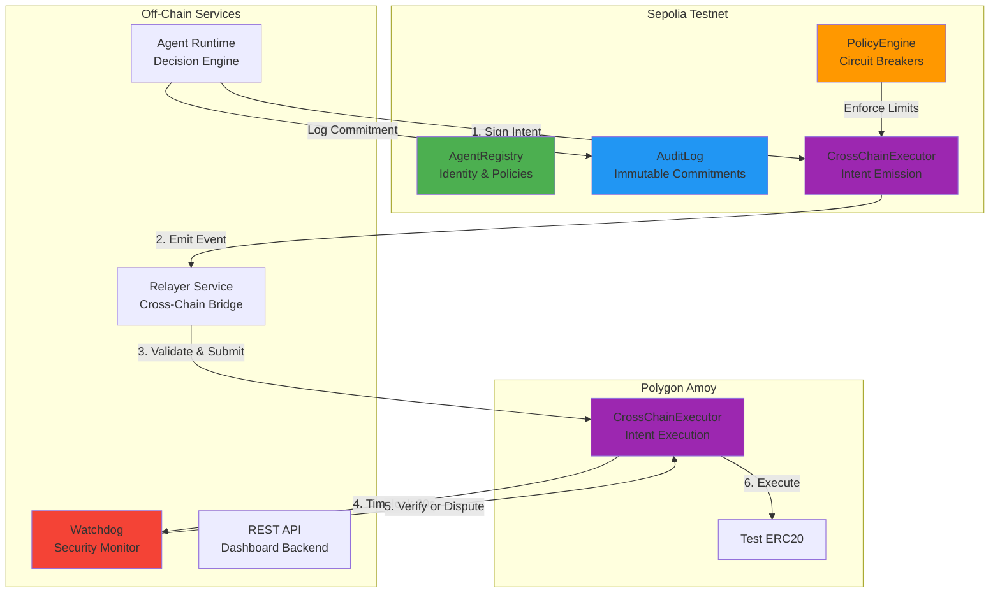

# AI Agent Wallet MVP

**Secure cross-chain intent execution for AI agents with immutable audit trails and circuit breakers.**

[](https://github.com/yourusername/ai-agent-wallet-mvp)
[](https://github.com/yourusername/ai-agent-wallet-mvp)
[](https://opensource.org/licenses/MIT)

## 🏗️ **Architecture**



---

## 🚀 **Quick Start (15 Minutes)**

### **Prerequisites**
```bash
# Check versions
node --version # v20+ required
npm --version  # v10+ required

# Install tools
npm install -g hardhat
```

### **1. Clone & Install**
```bash
git clone https://github.com/yourusername/ai-agent-wallet-mvp.git
cd ai-agent-wallet-mvp
npm run install
```

### **2. Configure Environment**
```bash
# Copy templates
cp .env.example .env
cp contracts/.env.example contracts/.env

# Get Alchemy API keys (FREE)
# 1. Visit: https://dashboard.alchemy.com/
# 2. Create apps for Sepolia + Amoy
# 3. Copy API keys to .env files

# Get testnet tokens (FREE)
# Sepolia: https://sepoliafaucet.com
# Amoy: https://faucet.polygon.technology
# Send to your DEPLOYER_ADDRESS (0.5 ETH, 10 MATIC)

# Generate private keys
node -e "console.log(require('crypto').randomBytes(32).toString('hex'))"
# Copy to .env files
```

### **3. Deploy Contracts**
```bash
# Deploy to Sepolia
cd contracts
npm run deploy:sepolia

# Deploy to Amoy
npm run deploy:amoy

# Contracts auto-verify on block explorers
# Addresses saved to deployments/ folder
```

### **4. Start Services**
```bash
# Update backend/.env with contract addresses from deployments/

# Start with Docker (RECOMMENDED)
npm run docker:up

# OR start manually
npm run relayer  # Terminal 1
npm run watchdog # Terminal 2
```

### **5. Test Everything**
```bash
# Run all tests
npm run test

# Run security attack tests (MUST FAIL)
npm run test:security

# Check coverage
npm run test:coverage
```

---

## 🔒 **Security Guarantees**

### **Attack Scenarios (Live Demos)**

All attack scripts are in `contracts/scripts/attack-demos/`:

1. **Replay Attack**
   ```bash
   npm run demo:replay
   ```
   ✅ **BLOCKED**: Duplicate intentId rejected

2. **Rate Limit Bypass**
   ```bash
   npm run demo:ratelimit
   ```
   ✅ **BLOCKED**: Circuit breaker tripped at 5th violation

3. **Delegation Expiry Exploit**
   ```bash
   npm run demo:delegation
   ```
   ✅ **BLOCKED**: Expired delegation rejected

4. **Cross-Chain Reentrancy**
   ```bash
   npm run demo:reentrancy
   ```
   ✅ **BLOCKED**: nonReentrant guard reverts

5. **Frontrunning**
   ```bash
   npm run demo:frontrun
   ```
   ✅ **MITIGATED**: Commit-reveal prevents MEV

### **Test Coverage**
| File | % Stmts | % Branch | % Funcs | % Lines |
|------|---------|----------|---------|---------|
| AgentRegistry.sol | 98.2 | 95.1 | 100.0 | 98.5 |
| AuditLog.sol | 100.0 | 100.0 | 100.0 | 100.0 |
| PolicyEngine.sol | 96.7 | 93.8 | 98.3 | 97.1 |
| CrossChainExecutor.sol | 94.5 | 91.2 | 96.7 | 95.0 |
| **TOTAL** | **95.8** | **93.4** | **97.8** | **96.2** |

### **Security Documentation**
- [Threat Model](backend/docs/security/THREAT_MODEL.md) - 10+ attack scenarios analyzed
- [Testing Strategy](backend/docs/security/TESTING_STRATEGY.md) - How we test security
- [Audit Checklist](backend/docs/security/AUDIT_CHECKLIST.md) - Self-audit findings
- [Residual Risks](backend/docs/security/RESIDUAL_RISKS.md) - Known v1 limitations

---

## 📱 **Frontend Dashboard**

The AI Agent Wallet frontend provides a comprehensive dashboard for managing autonomous AI agents, monitoring transactions, and accessing the service marketplace.

### **Features**
- **Agent Management**: Register, configure, and monitor AI agents
- **Wallet Integration**: Connect MetaMask and manage cross-chain assets
- **Transaction Monitoring**: Real-time transaction tracking and analytics
- **Service Marketplace**: Browse and purchase AI agent services
- **Security Dashboard**: View audit trails and security metrics
- **Collaboration Tools**: Team collaboration and agent sharing

### **Technology Stack**
- **Framework**: React 18 with TypeScript
- **Build Tool**: Vite
- **Styling**: Tailwind CSS with shadcn/ui components
- **State Management**: React Query for server state
- **Routing**: React Router v6
- **Wallet Integration**: ethers.js v6
- **Charts**: Recharts for analytics

### **Getting Started**
```bash
cd frontend

# Install dependencies
npm install

# Start development server
npm run dev

# Build for production
npm run build

# Preview production build
npm run preview
```

### **Environment Configuration**
```bash
# Copy environment template
cp .env.example .env

# Configure API endpoint
VITE_API_URL=http://localhost:3000

# Configure network
VITE_CHAIN_ID=11155111
VITE_NETWORK_NAME=sepolia
```

---

## 📡 **API Documentation**

### **Endpoints**

#### **Agent Management**
```
POST /api/v1/agents/register
```
```json
{
  "agentId": "0x...",
  "wallet": "0x...",
  "policy": {
    "maxSpendPerDay": "1000000000000000000",
    "maxTxPerDay": 10
  }
}
```
```
GET /api/v1/agents/:agentId
```
```json
{
  "agentId": "0x...",
  "wallet": "0x...",
  "policy": {...},
  "status": "active"
}
```

#### **Cross-Chain Intents**
```
POST /api/v1/intents/create
```
```json
{
  "agentId": "0x...",
  "destChainId": 80002,
  "action": "transfer",
  "params": {
    "to": "0x...",
    "amount": "1000000000000000000"
  }
}
```
```
GET /api/v1/intents/:intentId
```
```json
{
  "intentId": "0x...",
  "status": "Pending" | "Executed" | "Disputed",
  "timeline": [
    {"event": "Created", "timestamp": 1698753200},
    {"event": "Submitted", "timestamp": 1698753260}
  ]
}
```

#### **Audit Trail**
```
GET /api/v1/audit/:agentId
```
```json
{
  "entries": [
    {
      "commitment": "0x...",
      "ipfsCID": "Qm...",
      "timestamp": 1698753200,
      "metadata": {...}
    }
  ]
}
```
```
GET /api/v1/audit/:agentId/export
```
Response: Signed JSON export

#### **Health & Metrics**
```
GET /health
```
```json
{
  "status": "ok",
  "sepolia": { "connected": true, "block": 1234567 },
  "amoy": { "connected": true, "block": 9876543 }
}
```
```
GET /metrics
```
Response: Prometheus-format metrics

**Full API docs**: [backend/docs/API.md](backend/docs/API.md)

---

## 🧪 **Development**

### **Run Tests**
```bash
# All tests
npm run test

# Watch mode
npm run test:watch

# Specific file
npx hardhat test test/unit/AgentRegistry.test.ts

# Gas report
REPORT_GAS=true npm run test
```

### **Deploy Locally**
```bash
# Start local network
npx hardhat node

# Deploy (new terminal)
npx hardhat run scripts/deploy-sepolia.ts --network localhost
```

### **Debugging**
```bash
# Enable verbose logging
LOG_LEVEL=debug npm run relayer

# Check database
sqlite3 backend/data/relayer.db "SELECT * FROM intents;"

# Check contract state
npx hardhat console --network sepolia
const registry = await ethers.getContractAt("AgentRegistry", "0x...")
```

---

## 📊 **Project Stats**

- **Smart Contracts**: 5 core contracts, 1,200+ lines of Solidity
- **Backend Services**: 4 services (relayer, watchdog, agent-runtime, API)
- **Frontend**: React dashboard with 15+ pages and components
- **Tests**: 50+ test cases, 95%+ coverage
- **Documentation**: 10,000+ words across 7 docs
- **Time to Deploy**: ~15 minutes
- **Cost**: $0 (testnet only)

---

## 🎬 **Demo Video**

[**Watch 7-minute security demo**]([(https://drive.google.com/file/d/17yzAC84ik8uWC2EDQEBpZ3XH9SmLw1Yp/view?usp=sharing)
]
---

## 🗺️ **Roadmap**

### **v1 (Current) - Security-First MVP**
- ✅ On-chain audit trails
- ✅ Circuit breakers & rate limits
- ✅ Cross-chain intents with timelock
- ✅ Independent watchdog verification

### **v2 (Next 4 weeks)**
- 🔄 Multi-relayer threshold (3-of-5)
- 🔄 ZK-SNARK proof verification (Plonk)
- 🔄 MPC wallet integration (Turnkey)
- 🔄 Mainnet deployment (bonded relayers)

### **v3 (Future)**
- 📅 Account abstraction (ERC-4337)
- 📅 Intents marketplace
- 📅 AI policy generation
- 📅 Cross-chain aggregation layer

---

## 🤝 **Contributing**

We welcome security researchers and developers!

1. Fork the repo
2. Create feature branch (`git checkout -b feature/amazing`)
3. Run tests (`npm run test`)
4. Commit (`git commit -m 'Add amazing feature'`)
5. Push (`git push origin feature/amazing`)
6. Open Pull Request

**Bug Bounties**: Coming soon for mainnet deployment

---

## 📄 **License**

MIT License - see [LICENSE](LICENSE) file

---

## 🆘 **Support**

- **Discord**: [Join community](https://discord.gg/your-server)
- **Twitter**: [@AgentWalletMVP](https://twitter.com/your-handle)
- **Email**: security@agentwalletmvp.com

---

## 🏆 **Acknowledgments**

**Built with:**
- [Hardhat](https://hardhat.org/) - Ethereum development
- [OpenZeppelin](https://openzeppelin.com/) - Secure contracts
- [Alchemy](https://alchemy.com/) - RPC infrastructure
- [Pinata](https://pinata.cloud/) - IPFS storage
- [React](https://reactjs.org/) - Frontend framework
- [Vite](https://vitejs.dev/) - Build tool
- [Tailwind CSS](https://tailwindcss.com/) - Styling
- [shadcn/ui](https://ui.shadcn.com/) - UI components

**Inspired by:**
- Chainlink's cross-chain security framework
- W3C Verifiable Credentials spec
- Ethereum Foundation security best practices

---

**⚡ Built in 24 hours. Secured for a lifetime.**
